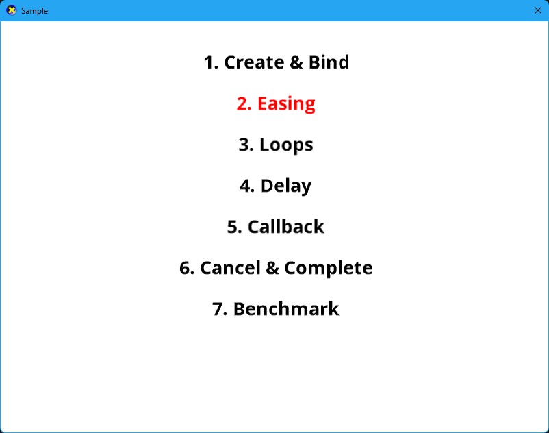

# LitMotionCpp

[English README is here.](README.md)

## 概要
[LitMotion](https://github.com/AnnulusGames/LitMotion)をC++に移植したものです。LitMotionはUnity向けのハイパフォーマンスなトゥイーンライブラリです。

Unityに依存した機能は省いていますが、あらゆるオブジェクトにアニメーションを追加できます。

## 特徴
* あらゆる値をコード一行でアニメーション可能
* マルチスレッド実行に対応
* イージングや繰り返しなど複雑な設定を適用可能
* コールバックによる完了の待機
* IMotionOptions と IMotionAdapter を用いた型の拡張

## セットアップ
### 要件
* C++20
### インストール
1. 以下のヘッダファイルをコピーしてパスを通す。
    * AnimationCurve.h
    * EaseUtility.h
    * FastListCore.h
    * IJobParallelFor.h
    * IMotionAdapter.h
    * IMotionOptions.h
    * IntegerOptions.h
    * LMotion.h
    * ManualMotionDispatcher.h
    * MotionBuilder.h
    * MotionCallbackData.h
    * MotionData.h
    * MotionDispatcher.h
    * MotionHandle.h
    * MotionScheduler.h
    * MotionStatus.h
    * MotionStorage.h
    * MotionStorageManager.h
    * MotionUpdateJob.h
    * NoOptions.h
    * ParallelJobScheduler.h
    * PrimitiveMotionAdapter.h
    * UpdateRunner.h
2. LitMotionCpp.libをリンクする。
3. アニメーション機能を使用したい箇所で LMotion.h をインクルードする。
4. メインループの先頭で MotionDispatcher::setRealSinceStartup() を呼び出し、アニメーションを更新したいタイミングで MotionDispatcher::update() を呼ぶ。

## スタートガイド
LitMotionCppを用いることでオブジェクトの値を簡単にアニメーションさせることができます。モーションを作成するには LMotion::create() を使用します。

以下にコードのサンプルを示します。

example.h
~~~cpp
#include "LMotion.h"

enum class PlayerLoopTiming
{
    Update=0,
    PostUpdate=1,
};

struct SpriteData
{
    int id;
    float x;
    float y;
};

class Example
{
private:
    LitMotionCpp::MotionScheduler m_scheduler;
    SpriteData m_target1;
    SpriteData m_target2;
    float m_value;
    bool m_completed;
public:
    Example();
    void setup();
};
~~~

example.cpp
~~~cpp
#include "example.h"

using namespace LitMotionCpp;

Example::Example()
    :m_scheduler(MotionScheduler::createPlayerLoop(PlayerLoopTiming::PostUpdate))
{

}

void Example::setup()
{
    LMotion::create(0.0f,1.0f,2.0f) //  0.0fから1.0fまで２秒間で値をアニメーション
        .bind<SpriteData>(&m_target1, { pState->x = value; });  //  m_target1.xにバインドする

    LMotion::create(0.0f,10.0f,2.0f)    //  0.0fから10.0fまで２秒間で値をアニメーション
        .withEase(Ease::OutQuad)         //  イージング関数を指定
        .withLoops(2, LoopType::Yoyo)   //  ループ回数やループの形式を指定
        .withDelay(0.2f) // 遅延を設定
        .bind<SpriteData>(&m_target2, { pState->x = value; });  //  m_target2.xにバインドする

    m_completed=false;
    LMotion::create(0.0f,10.0f,2.0f)    //  0.0fから10.0fまで２秒間で値をアニメーション
        .withScheduler(m_scheduler) //  実行タイミングをschedulerで指定
        .withOnComplete([this](){m_completed=true;})    //  コールバックを設定
        .withCancelOnError()    //  Bind内で例外が発生したらモーションをキャンセルする
        .bind<Example>(this,{ pState->m_value=value;});  //  任意の変数にバインド可能。キャプチャは不可。

    //  作成したモーションの制御は MotionHandle 構造体を介して行う
    auto handle=LMotion::create(0.0f,1.0f,2.0f).runWithoutBinding();

    if(handle.isActive())   //  モーションが再生中の場合はtrueを返す
    {
        handle.cancel();    //  モーションをキャンセルする
        handle.complete();  //  モーションを完了する
    }
}
~~~
## Unity機能の代替
### updateの呼び出しと更新時刻の取得
UnityではPlayerLoopに登録することでupdateが呼び出されるようになり、Timeオブジェクトからフレーム更新時刻を取得できる。

LitMotionCppではフレーム開始時に時刻を設定し、フレーム処理内でupdateを呼び出す必要がある。
~~~cpp
void Game::Update(DX::StepTimer const& timer)
{
    //  フレームの開始時刻を設定する
    MotionDispatcher::setRealtimeSinceStartup(timer.GetTotalSeconds());

    //  デフォルトのスケジューラに登録されているモーションを更新する
    MotionDispatcher::update(MotionScheduler::getDefaultScheduler());
}
~~~
### AnimationCurve
キーフレームからベジェ曲線を保管するAnimationCurveクラスを実装してあります。キーフレームデータを用意して withEase 関数に渡してください。キーフレームデータのコピーは行わす、ポインタを保持しているだけなのでアニメーションが終了するまで元のデータを消したりしないでください。
~~~cpp
using namespace LitMotionCpp;

const Keyframe keyframes[] = {
	{0.0f, 0.0f, 0.0f, 0.0f},
	{0.32483720779418948f, 0.9665907025337219f, 0.08513136953115463f, 0.08513136953115463f},
	{0.6239457130432129f, -0.027526676654815675f, 0.59372878074646f, 0.59372878074646f},
	{0.6815565824508667f, 1.0051050186157227f, -0.017104098573327066f, -0.017104098573327066f},
	{0.8800565600395203f, -0.01362311840057373f, -0.00554767856374383f, -0.00554767856374383f},
	{1.0f, 1.0f, 0.0f, 0.0f}
};

void Example::setup()
{
    LMotion::create(-5.0f, 5.0f, 3.0f)
        .withEase(std::begin(keyframes), std::end(keyframes))
        .bind<Example>(this,{pState->m_value=value;});
}
~~~
Factory関数を登録することでオリジナルのキーフレーム補間を行う実装に差し替えることもできます。
~~~cpp
void Game::registerAnimationCurveFactory()
{
    AnimationCurve::setFactory( -> AnimationCurve* {
        return new DirectXMathAnimationCurve(begin,end,preMode,postMode);
		});
}
~~~
参照 Wikipedia
[３次エルミートスプライン](https://ja.wikipedia.org/wiki/3%E6%AC%A1%E3%82%A8%E3%83%AB%E3%83%9F%E3%83%BC%E3%83%88%E3%82%B9%E3%83%97%E3%83%A9%E3%82%A4%E3%83%B3),
[ベジェ曲線](https://ja.wikipedia.org/wiki/%E3%83%99%E3%82%B8%E3%82%A7%E6%9B%B2%E7%B7%9A)
### DOTS
デフォルトの実装ではメインスレッドで更新を行っています。IJobParallelFor インターフェイスを実行する関数を登録するとマルチスレッドで更新させるこができます。Sampleプロジェクトでも簡易なJobSystemを実装しています。
~~~cpp
void Game::registerJobSystem()
{
    //  ワーカースレッドを４つ起動する
	JobSystem::initialize(4);

	//  ジョブシステム起動関数登録
    ParallelJobScheduler::setExecuter({
        auto handle=JobSystem::schedule([&job](size_t index) {
			    job.execute(static_cast<int>(index));
			}, size, innerLoopBatchCount);
		handle.wait();
		});
}
~~~
参照 
[C++でジョブシステムを作ってみる(1)](https://zenn.dev/nishiki/articles/01ff1417f0b85f)
### サンプルプロジェクト
サンプルシーンをアプリケーションとして実装し、メニュー画面を追加しました。
* カーソルの上下でサンプルを選択し、スペースキーで実行します。
* メニューに戻るには実行が終了してからESCキーを押してください。
* 実行が終了してからスペースキーを押すともう一度繰り返します。

## ライセンス

[MIT License](LICENSE)

## サンプルで使用しているライブラリ

[Vecmath-cpp](https://github.com/yuki12/vecmath-cpp)
